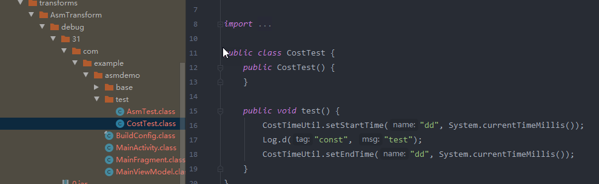
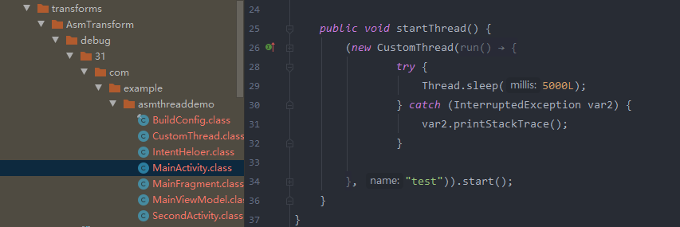

# ASM使用Demo
## 方法增加耗时记录统计
编译时注解在test方法前后增加了CostTimeUtil方法

	//编译前
	public class CostTest {
	    @ACost(name = "dd")
	    public void test() {
	        Log.d("const", "test");
	    }
	}

## 线程替换成有名字的线程
线程替换成有名字的线程，主要是第三方jar,aar的替换，方便定位bug

	//编译前
	public void startThread() {
	        new Thread(new Runnable() {
	            @Override
	            public void run() {
	                try {
	                    Thread.sleep(5000);
	                } catch (InterruptedException e) {
	                    e.printStackTrace();
	                }
	            }
	        }, "test").start();
	    }

